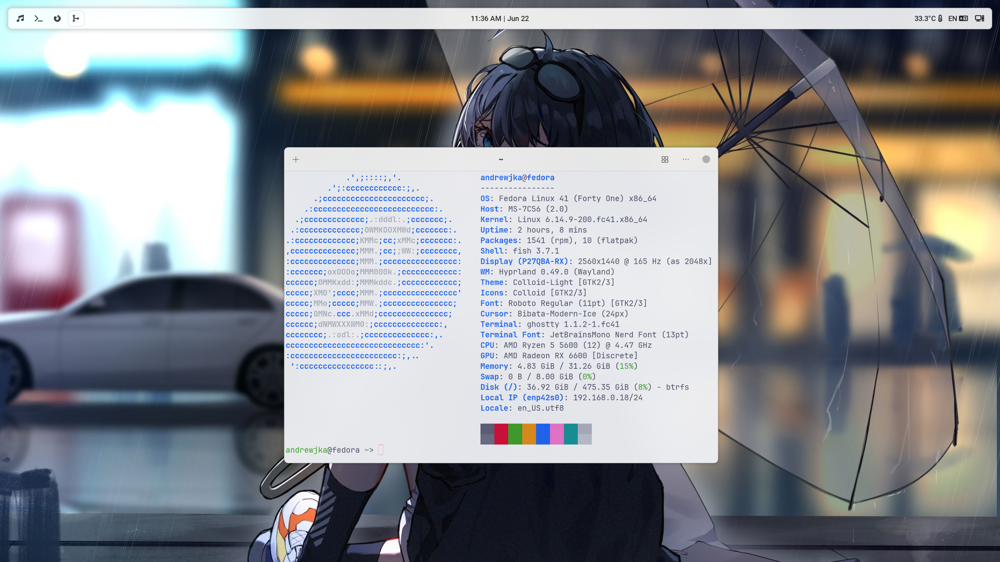

# Quiteasy-shell

## About
My build of a graphical environment under the fedora distribution, based on the hyprland tile manager.
Unfortunately, I'm still bad at building packages, so I'll just leave all the necessary files here for now.

## System requitements
The mishmash of packages for my environment has not been tested anywhere else yet and has only run on Fedora Linux 41.

## Overview

